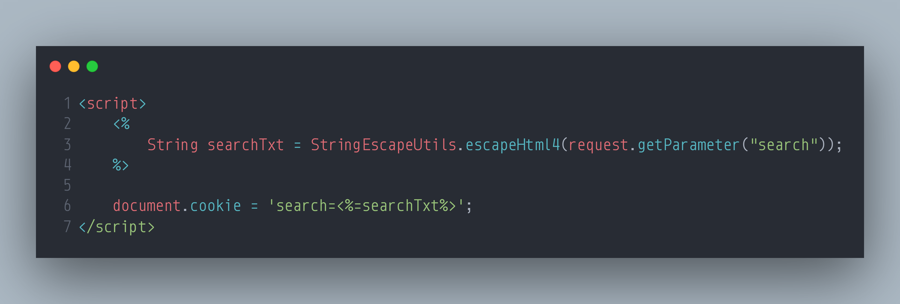

### SecurityExplained S-12: Vulnerable Code Snippet - 1

#### Vulnerable Code:



#### Solution:

The above code is vulnerable to cross-site scripting attacks due to improper filtration! The encoding is missing a single quote (') and it is possible to execute an XSS with payloads such as: '+alert(1)+'.

This is example of JSP code, <% %> tags are used in Java Servlet Pages to dynamically generate servlets using Java syntax. Here, escapeHtml4 is being used from StringEscapeUtils library whose main purpose is quite obvious from its name i.e to escape characters given in a string as input.

As mentioned [here](<https://commons.apache.org/proper/commons-lang/javadocs/api-3.1/org/apache/commons/lang3/StringEscapeUtils.html#escapeHtml4(java.lang.String)>) in the official documentation of StringEscapeUtils, the escapeHtml4 does not supports the encoding of apostrophe (') character.

Hence, entering the payload ` '+alert+'` will result in XSS pop up as apostrophes go unescaped by the function.

The resulting javascript code looks something like this after replacing our payload

`document.cookie = 'search='+alert(1)+''; `

Hence the alert(1) executes, you can verify it by running this piece of code in your browser's console.

One way to fix this is to manually encode apostrophe by using `replace` with function

```
String searchTxt = StringEscapeUtils.escapeHtml4(request.getParameter("search")).replace("'","&#39;");
```

##### Code Credits: OWASP Secure Coding Dojo

[Follow Twitter Thread](https://twitter.com/harshbothra_/status/1481257258734727171?s=20&t=DGEwqEwXwFbWH0VXkOKVsQ)
