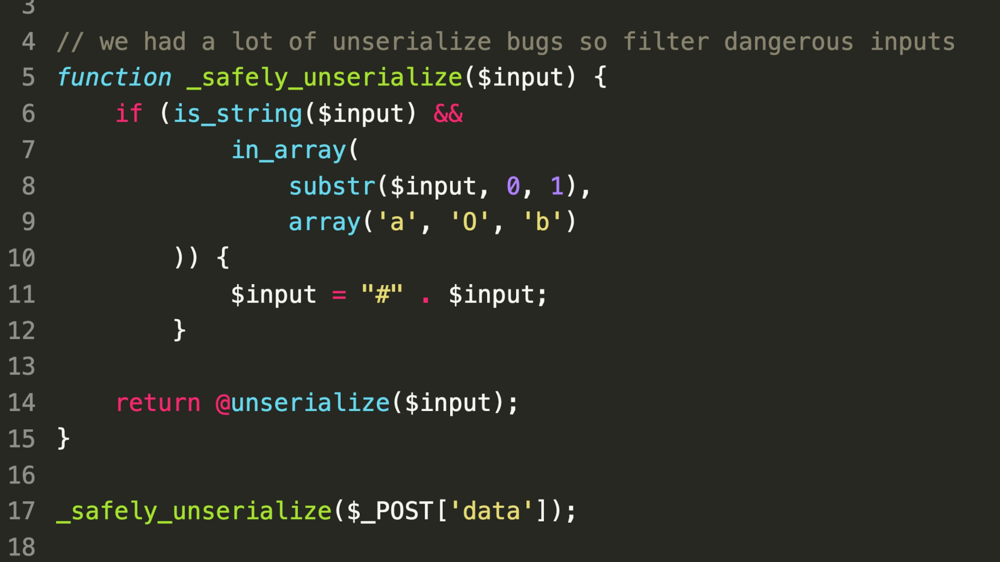

### SecurityExplained S-23: Vulnerable Code Snippet - 11

#### Vulnerable Code: 

#### Solution: 

This answer is by SonarSource: There are two ways to serialize classes in PHP, both with O: and C:. The second encoding mode is not supported by the blocklist, and arbitrary objects could then be deserialized! It's not enough to get RCE, but it's a good start.

##### Code Credits: SonarSource