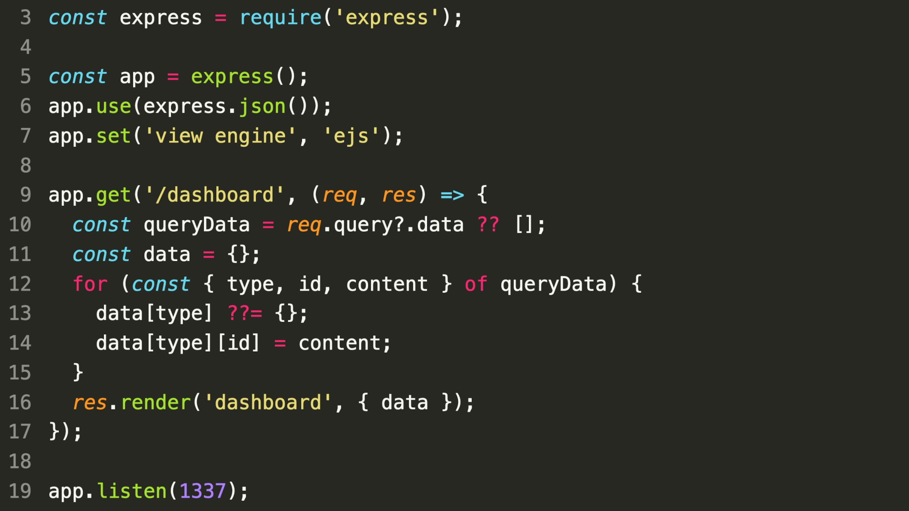

### SecurityExplained S-24: Vulnerable Code Snippet - 12

#### Vulnerable Code:

#### Solution:

The code is vulnerable to prototype pollution that could even lead to remote code execution. The statement in line 12 uses a dangerous pattern that allows for Prototype Pollution. When type is set to **proto**, then id and content can specify a key and value that will be set on Object.prototype.

##### Code Credits: SonarSource

[Follow Twitter Thread](https://twitter.com/harshbothra_/status/1485639304861069313?s=20&t=DGEwqEwXwFbWH0VXkOKVsQ)
