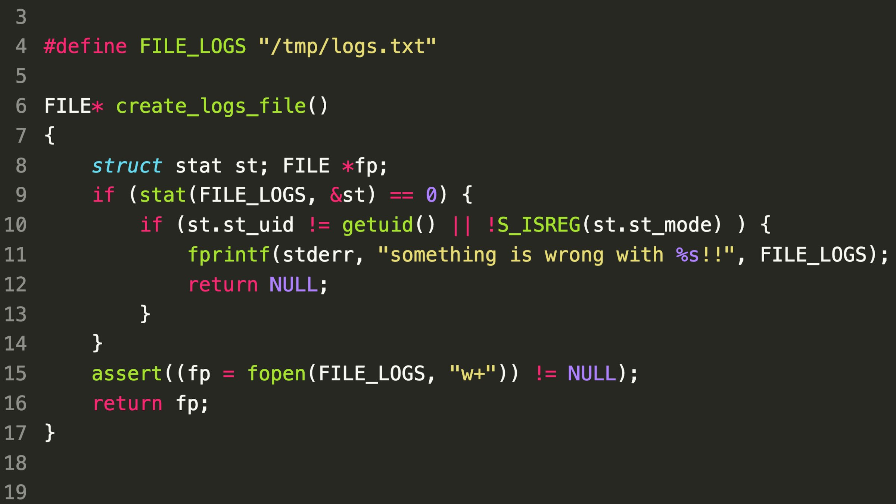

### SecurityExplained S-27: Vulnerable Code Snippet - 15

#### Vulnerable Code:

#### Solution:

As per SonarSource, There is a ToCToU (Time of Check - Time of Use) bug: if the file does not exist at the time of the checks, they will be skipped. Attackers could create a symlink at /tmp/logs.txt right before the call to fopen(), and write to an unintended destination! It's very common to find file checks vulnerable to such ToCToU bugs. The best ways to avoid it is to perform these operations in folders with restrictive permissions and prefer file descriptors to paths (fstat, etc).

##### Code Credits: SonarSource

[Follow Twitter Thread](https://twitter.com/harshbothra_/status/1486753867047997442?s=20&t=DGEwqEwXwFbWH0VXkOKVsQ)
