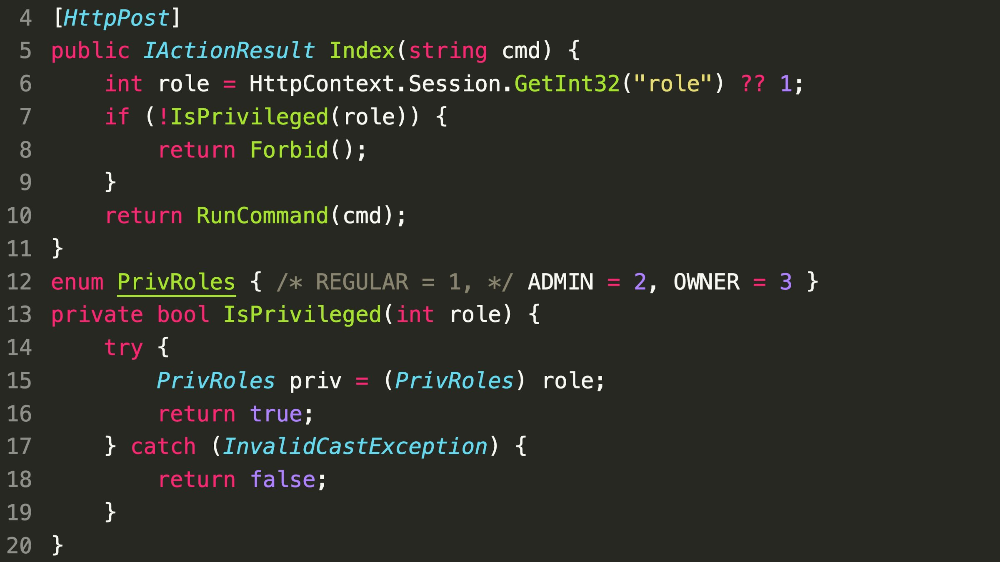

### SecurityExplained S-29: Vulnerable Code Snippet - 17

#### Vulnerable Code:

#### Solution:

As per @SonarSource, isPrivileged() will always return true because casting an int to an int-based enum never throws an exception, even if there is no enum member corresponding to that number. To make the check correct, it has to return PrivRoles.IsDefined((PrivRoles) role).

##### Code Credits: SonarSource

[Follow Twitter Thread](https://twitter.com/harshbothra_/status/1487434398186508294?s=20&t=DGEwqEwXwFbWH0VXkOKVsQ)
