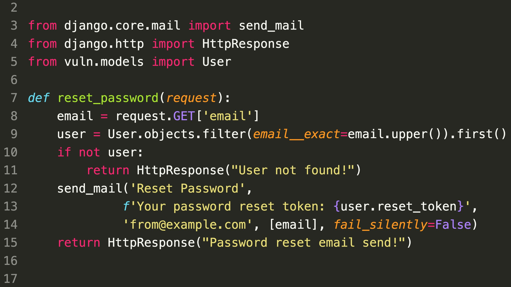

### SecurityExplained S-30: Vulnerable Code Snippet - 18

#### Vulnerable Code: 

#### Solution: 

As per SonarSource, At line 9, the email is transformed to uppercase before its use in the SQL query. On Unicode characters, this process has the unintended effect that two distinct code points may result in the same one.

It can be used to send the password reset token to another email and takeover accounts:  

foo@mix.com -> FOO@MIX.com
foo@mıhttp://x.com -> FOO@MIX.com

Interesting Blog: https://t.co/UxdZJQxzc1

##### Code Credits: SonarSource