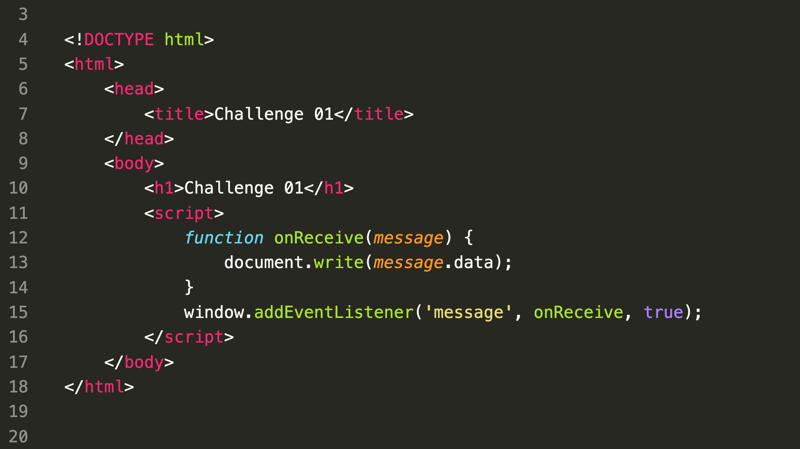

### SecurityExplained S-13: Vulnerable Code Snippet - 2

#### Vulnerable Code:

#### Solution:

The above code is vulnerable to cross-site scripting attack as it can be observed that on the line 15, a handler for message events is registered which writes the event's data in the DOM on the line 13.
It is possible to embed this page and send an event with an XSS payload to execute a successful attack.

Similar Bug: https://blog.sonarsource.com/ghost-admin-takeover

##### Code Credits: SonarSource

[Follow Twitter Thread](https://twitter.com/harshbothra_/status/1481606121991598081?s=20&t=DGEwqEwXwFbWH0VXkOKVsQ)
