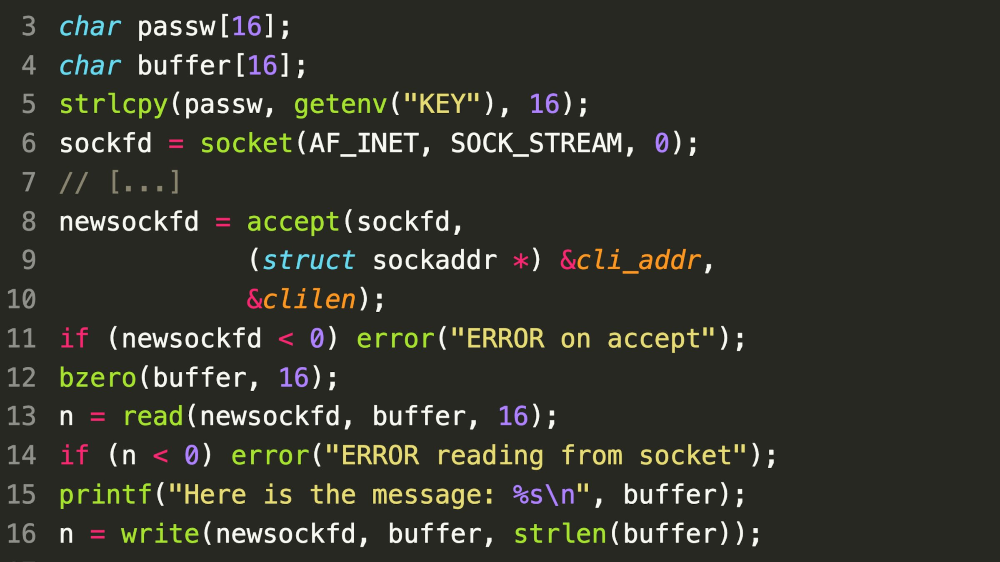

### SecurityExplained S-33: Vulnerable Code Snippet - 20

#### Vulnerable Code:

#### Solution:

As per @SonarSource, The problem lies with the server reading 16 bytes on line 13 into its buffer without making sure that the string is null-terminated (the last byte of the buffer is null). Sending 16 non-null bytes to the server will return them and the adjacent buffer containing sensitive data!

##### Code Credits: SonarSource

[Follow Twitter Thread](https://twitter.com/harshbothra_/status/1488907363184566275?s=20&t=DGEwqEwXwFbWH0VXkOKVsQ)
