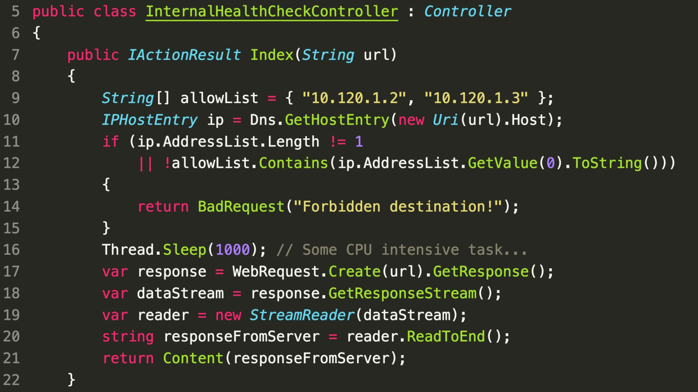

### SecurityExplained S-34: Vulnerable Code Snippet - 21

#### Vulnerable Code: 

#### Solution: 

As per @SonarSource, This risk of DNS rebinding is always easy to overlook: Dns.GetHostEntry() does a first DNS query, validates the result against the allow-list, and then WebRequest does a second DNS query. Both DNS queries can have a different response, and unintended servers could be reached that way. Always work with the value you first validated!

##### Code Credits: SonarSource