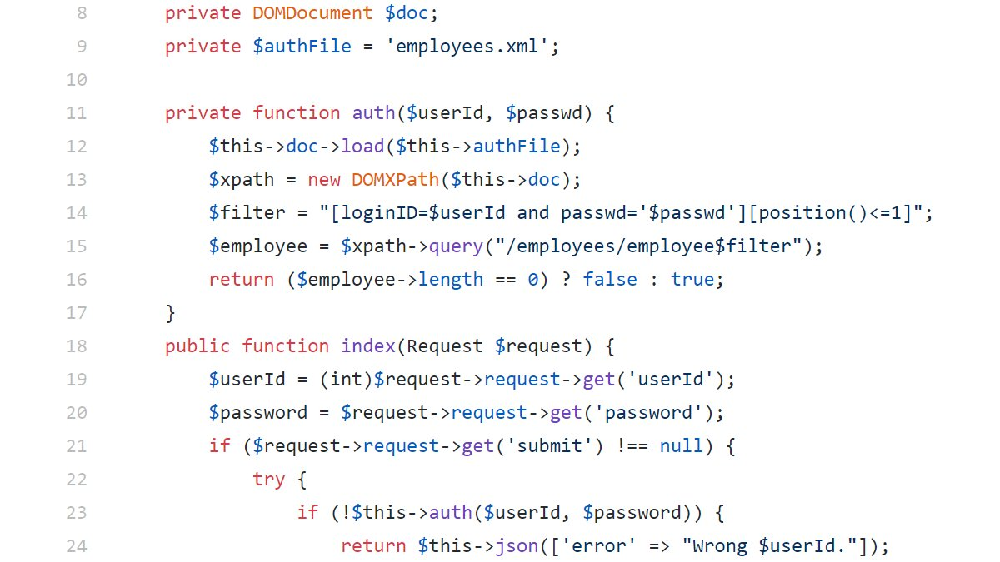

### SecurityExplained S-36: Vulnerable Code Snippet - 23

#### Vulnerable Code: 

#### Solution: 
The code utilizes XPath queries and due to lack of sanitization on line-14, it is possible to perform XPATH injection. 

Twitter Thread: https://twitter.com/harshbothra_/status/1489896229970792449
##### Code Credits: SonarSource