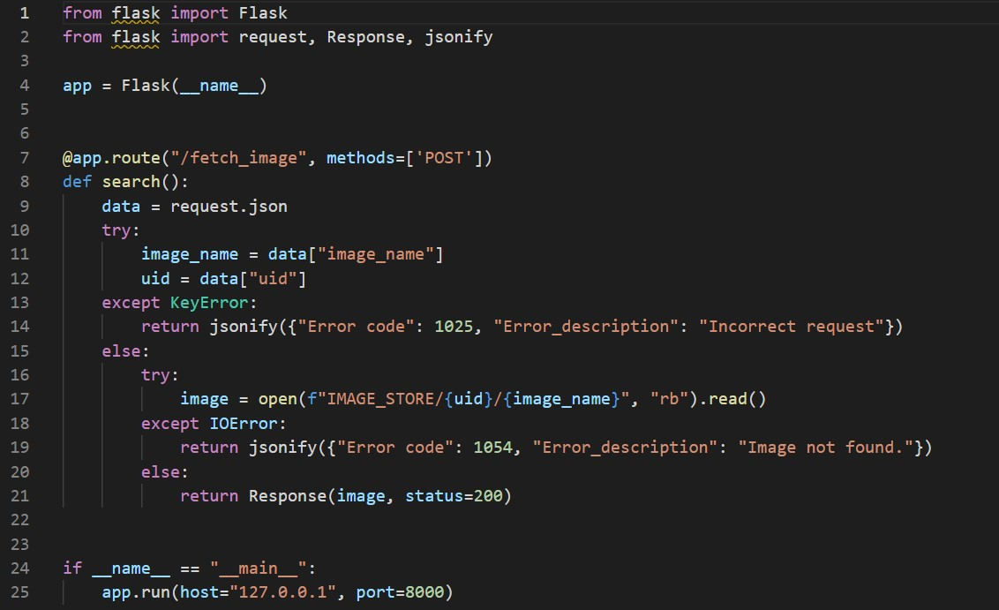

### SecurityExplained S-37: Vulnerable Code Snippet - 24

#### Vulnerable Code: 

#### Solution: 

The above code is vulnerable to Local File Inclusion (LFI) due to improper sanitization on receiving user input on line-11 and line-12. An attacker may attempt to submit a malicious payload and gain access to internal files.

Twitter Thread: https://twitter.com/harshbothra_/status/1490320844962377728

##### Code Credits: @ChetanyaKunndra