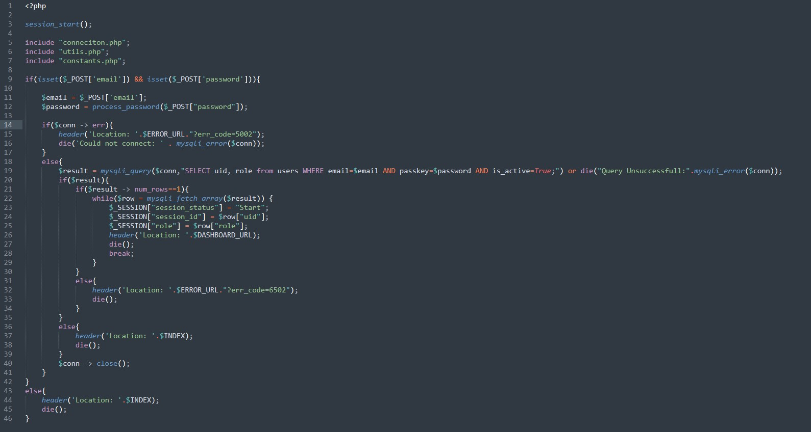

### SecurityExplained S-39: Vulnerable Code Snippet - 26

#### Vulnerable Code: 

#### Solution: 

This code demonstrates a basic SQL Injection vulnerability. As observed in the code, there is no sanitization performed & the user-controlled input is directly supplied. Looking at Line-19, it can be clearly seen as an SQLi issue.

Twitter Thread: https://twitter.com/harshbothra_/status/1490792057597616128 

##### Code Credits: @ChetanyaKunndra
 