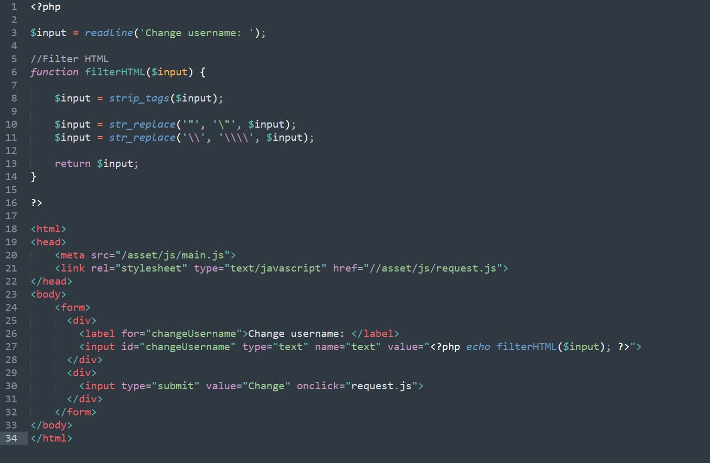

### SecurityExplained S-40: Vulnerable Code Snippet - 27

#### Vulnerable Code: 

#### Solution: 

This code is vulnerable to Cross-Site Scripting (XSS) attack. Example Payload: \"onload=alert(1)//

This payload works because the "replace()" function in PHP do not properly replace the user input. The first replacement works fine replace('\"', '') but when it later replace('\\', '\\\\'), the issue occurs. The issue is that the replacement for '"' is first and coverted to '\"'. When the other replace statement is called it sees '\"' and replace the '\' with a duel backslash '\\' but this in fact destroys the filter itself.

Example:
value = "\\"<outbreak>"

Twitter Thread: https://twitter.com/harshbothra_/status/1491160060076376065

##### Code Credits: @Brumens2
 