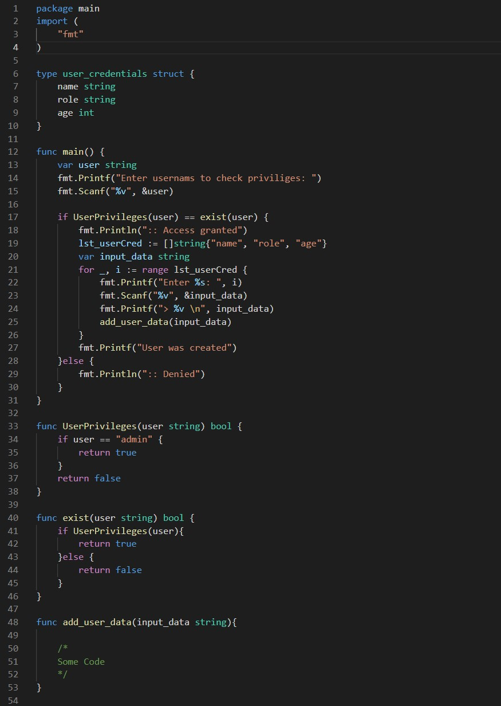

### SecurityExplained S-41: Vulnerable Code Snippet - 28

#### Vulnerable Code: 

#### Solution: 

@Brumens2 explained that this code is vulnerable to Insecure Direct Object Reference. The issue is that the if statement do check with "==" and not "&&" on line-17. This means if irrespective of "true" or "false" condition, it will grant the permission.

Twitter Thread: https://twitter.com/harshbothra_/status/1491644512204394498

##### Code Credits: @Brumens2
 