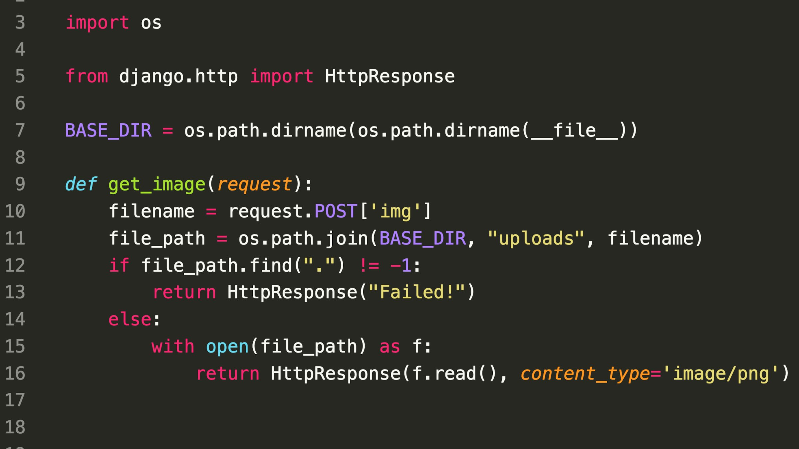

### SecurityExplained S-15: Vulnerable Code Snippet - 3

#### Vulnerable Code: 

#### Solution: 

The issue lies in the line 11 due to the use of "os.path.join()" and the issue here is an attacker can read arbitrary files by supplying malicious paylod through img variable. 

As per the documentation, when the values passed in "os.path.join()" & one of the paths to concatenate is absolute, previous values will be ignored.

Hence, here the string passed in "os.path.join(harsh,/etc/passwd)" return as "/etc/passwd" resulting into accessing the sensitive file. 

##### Code Credits: SonarSource