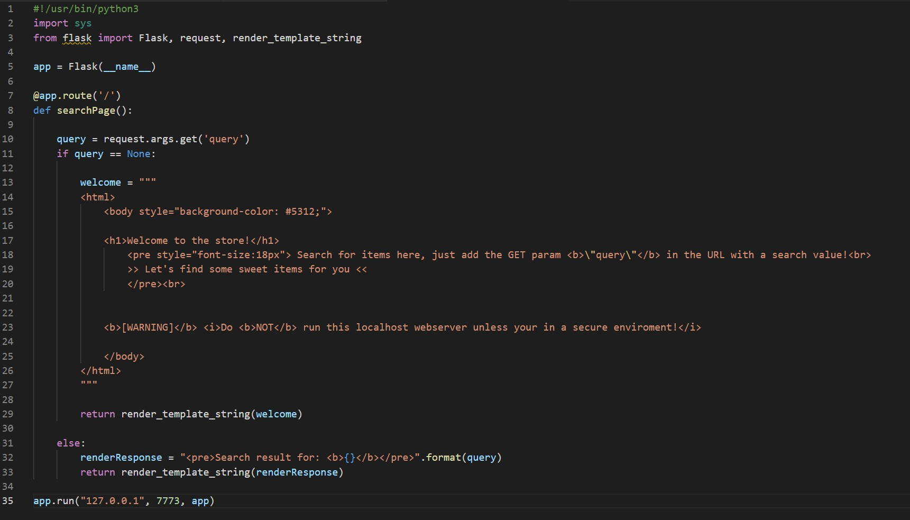

### SecurityExplained S-43: Vulnerable Code Snippet - 30

#### Vulnerable Code: 

#### Solution: 

This code is vulnerable to SSTI and as a result, an attacker may attempt to gain RCE. The code uses "user input" to search in its store. However, it does not filter the return value of the template render.

Ex Payload: {{10-6}} => 4

Twitter Thread: https://twitter.com/harshbothra_/status/1492332636756398083

##### Code Credits: @Brumens2 
 