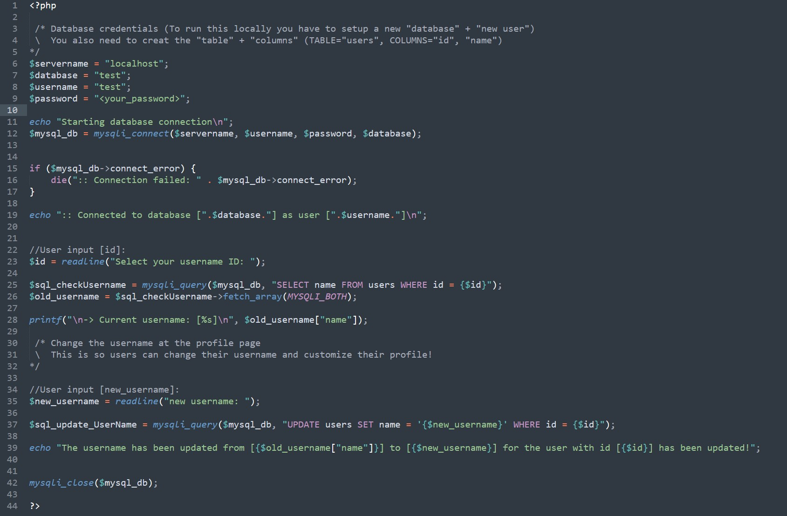

### SecurityExplained S-44: Vulnerable Code Snippet - 31

#### Vulnerable Code: 

#### Solution: 

This code connects to the backend database & its purpose is to change the username inside the profile page. It first checks the username "id" by user input and runs a SQL statement to extract the current username for that user.  The issue is that user input is not filtered. If you infect the "id" when it's reading the user input. It does not convert the "id" variable into an (int) type or filters it. This makes it possible to get access to the database fully by executing a SQL Injection.

Example Payload: sleep(1): Will sleep "x" row that is in the table. At "line 24".

Twitter Thread: https://twitter.com/harshbothra_/status/1492657271662206976

##### Code Credits: @Brumens2 
 