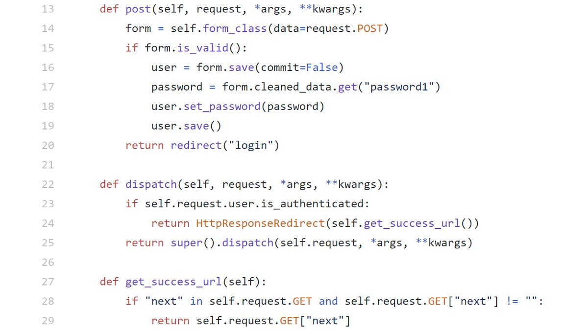

### SecurityExplained S-45: Vulnerable Code Snippet - 32

#### Vulnerable Code: 

#### Solution: 

This code is vulnerable to open redirection attack as the function "get_success_url" on line-27 doesn't properly implement the checks and the "Next" parameter is not using any whitelists. This may result into a redirection issue.

Twitter Thread: https://twitter.com/harshbothra_/status/1493042310589947906

##### Code Credits: @SonarSource
 