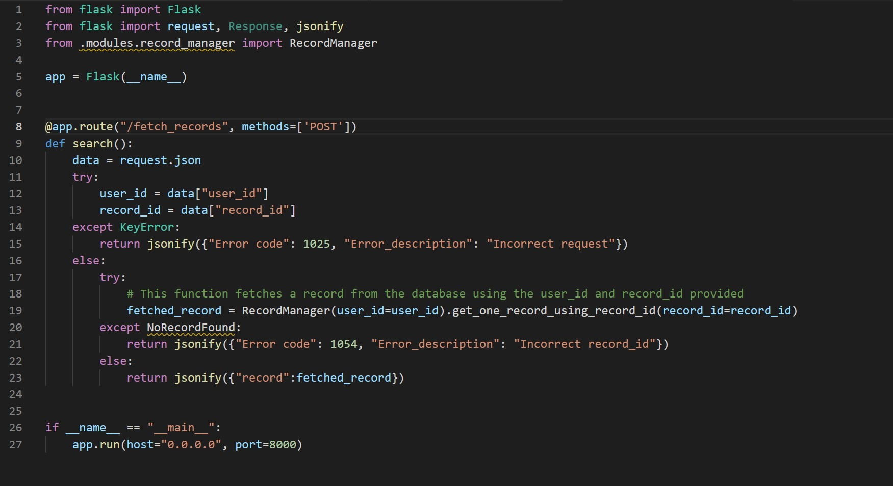

### SecurityExplained S-47: Vulnerable Code Snippet - 34

#### Vulnerable Code: 

#### Solution: 

This code is vulnerable IDOR as the user_id and record_id are not properly protected by the authorization verification and as a result an attacker who can guess/know these two parameters can access other user's information. 

Twitter Thread: https://twitter.com/harshbothra_/status/1493789734392373253

##### Code Credits: @ChetanyaKunndra 
 