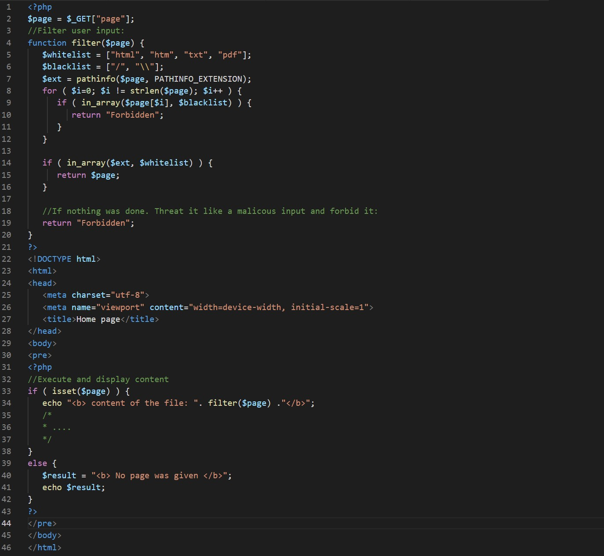

### SecurityExplained S-47: Vulnerable Code Snippet - 35

#### Vulnerable Code: 

#### Solution: 

The code is vulnerable to XSS and LFI. The focus in this code is that the filename can be used as a payload to execute Javasript and preform an XSS attack. 
When filtering a function always remember that it's more than one bug that can be exploited in it. For example this is highly vulnerable to LFI but it's also vulnerable to XSS.

Twitter Thread: https://twitter.com/harshbothra_/status/1494127206552985605

##### Code Credits: @Brumens2 
 