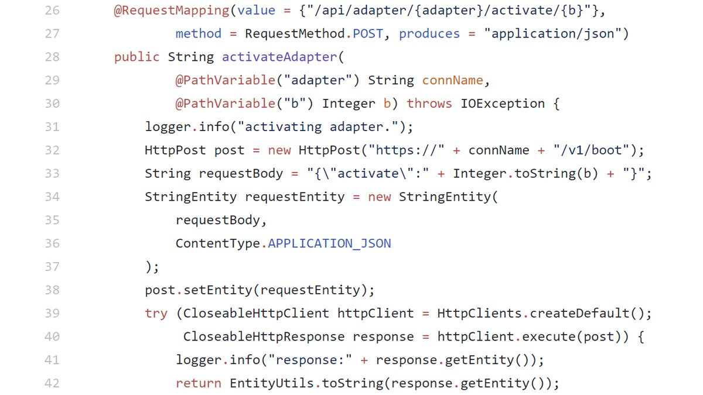

### SecurityExplained S-49: Vulnerable Code Snippet - 36

#### Vulnerable Code: 

#### Solution: 

This code is vulnerable to Server-Side Request Forgery due to improper filtration in the "connName". An attacker can abuse it perform the attack successfully.

Twitter Thread: https://twitter.com/harshbothra_/status/1494127206552985605

##### Code Credits: @SonarSource