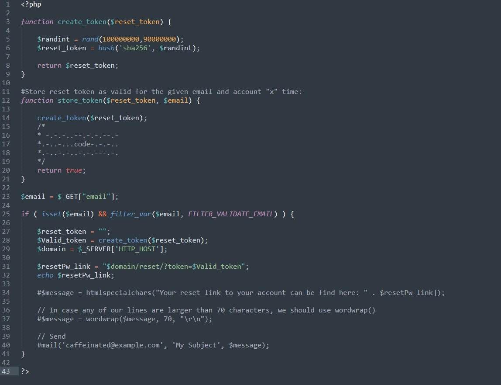

### SecurityExplained S-50: Vulnerable Code Snippet - 37

#### Vulnerable Code: 

#### Solution: 

This code is vulnerable to Host Header Injection as the code takes the value of HOST in the password reset link from request itself. This may allow an attacker to inject arbitrary host in the password reset link and get hold of the valid reset token to perform a successful password reset attack.

Twitter Thread: https://twitter.com/harshbothra_/status/1494777872929542144

##### Code Credits: @Brumens2