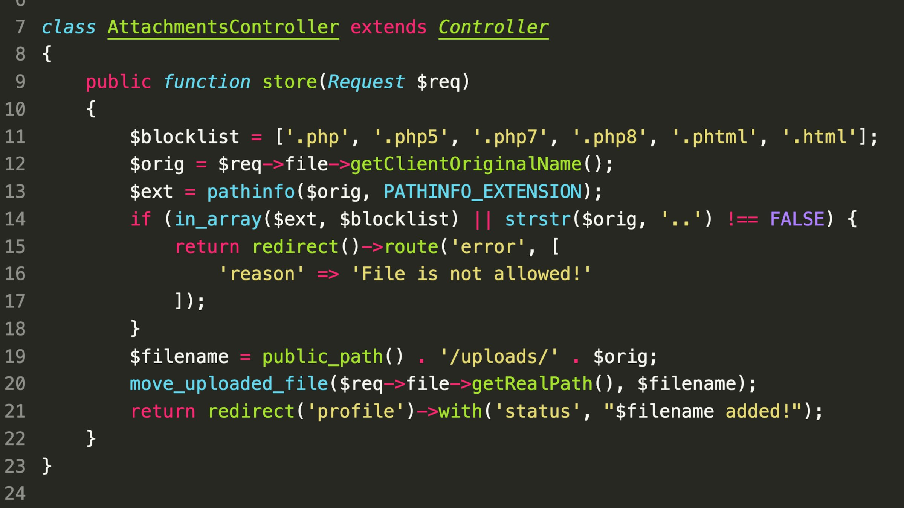

### SecurityExplained S-16: Vulnerable Code Snippet - 4

#### Vulnerable Code:

#### Solution:

The issue in this code snippet is the use of Blacklist (Denylist) instead of using a Whitelist (Allowlist). An attacker can bypass this protection in multiple ways and upload a malicious file on the server.

##### Code Credits: SonarSource

[Follow Twitter Thread](https://twitter.com/harshbothra_/status/1482740498683285506?s=20&t=DGEwqEwXwFbWH0VXkOKVsQ)
