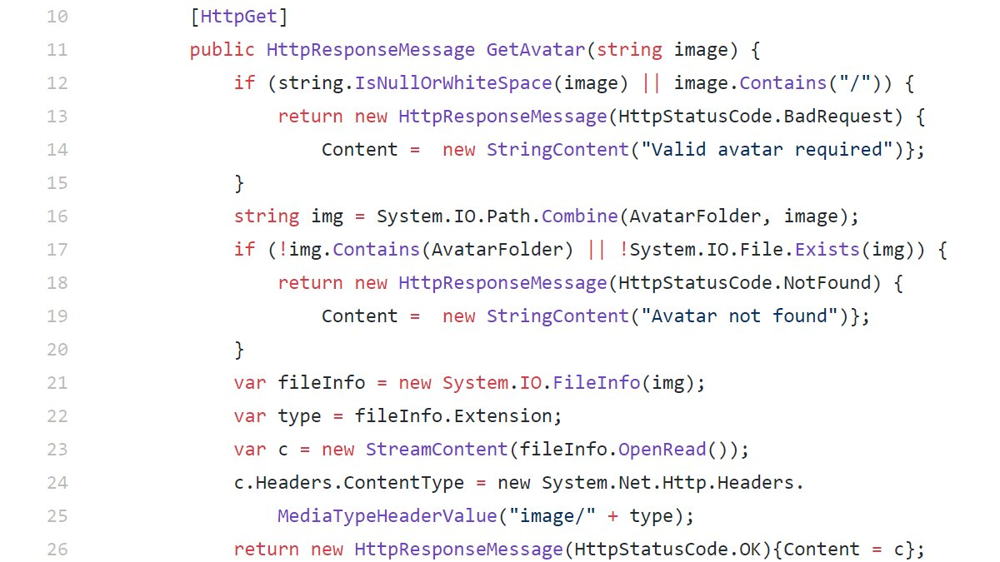

### SecurityExplained S-53: Vulnerable Code Snippet - 40

#### Vulnerable Code: 

#### Solution: 

This code is vulnerable to Local File Inclusion as the backslash character can be used in a path traversal attack (..\) to disclose arbitrary files from the (Windows) host.

Twitter Thread: https://twitter.com/harshbothra_/status/1495950722000580608

##### Code Credits: @SonarSources