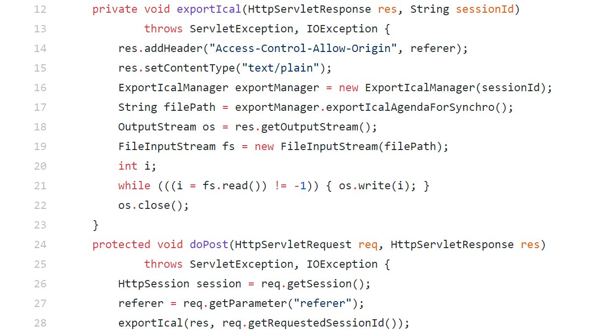

### SecurityExplained S-54: Vulnerable Code Snippet - 41

#### Vulnerable Code: 

#### Solution: 

This code is vulnerable to CORS misconfiguration as can be observed on line-14. User-provided data, such as URL parameters, POST data payloads, or cookies, should always be considered untrusted and tainted. Applications constructing HTTP response headers based on tainted data could allow attackers to change security sensitive headers like Cross-Origin Resource Sharing headers.

Twitter Thread: https://twitter.com/harshbothra_/status/1496326447954341891

##### Code Credits: @SonarSource