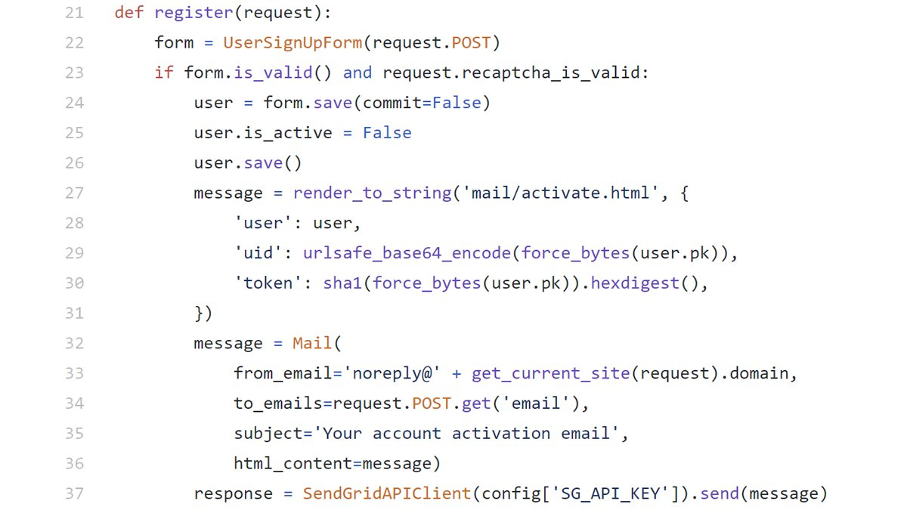

### SecurityExplained S-55: Vulnerable Code Snippet - 42

#### Vulnerable Code: 

#### Solution: 

This code is vulnerable to multiple security vulnerabilities: 
1. The token generation algorithm is SHA-1 which is known to collision attacks and is not a best practice to use it. 
2. There is a possibility of account takeover based on the actual implementation as an attacker may attempt to inject emails to get it routed to attacker email along with victim email. 
3. This also looks vulnerable to Host Header Injection attack. 

Twitter Thread: https://twitter.com/harshbothra_/status/1496668703181651972

##### Code Credits: @SonarSource