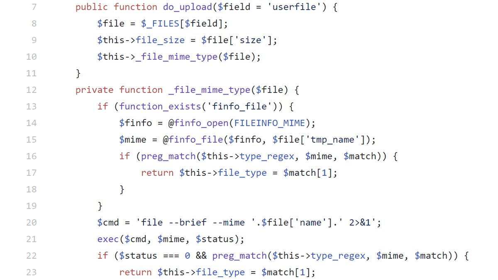

### SecurityExplained S-56: Vulnerable Code Snippet - 43

#### Vulnerable Code: 

#### Solution: 

This code is vulnerable to Command Injection as an attacker can inject malicious shell commands into the name of an uploaded file by using characters such as ";" or "`" to start a new command.

Twitter Thread: https://twitter.com/harshbothra_/status/1496993342378242063

##### Code Credits: @SonarSource