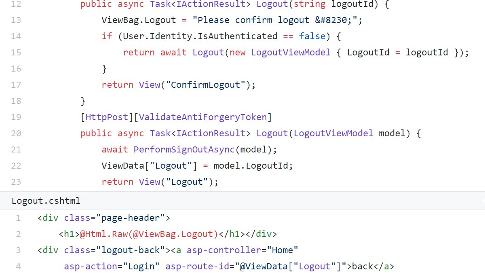

### SecurityExplained S-57: Vulnerable Code Snippet - 44

#### Vulnerable Code: 

#### Solution: 

As per @SonarSource, there is an XSS issue but maybe not as expected. Razor takes care of output encoding for ViewData in line 4. However, ViewData also overwrites the static content in ViewBag & there is an XSS in line 2.
Read More:  https://sonarcloud.io/project/issues?id=SonarSourceResearch_2020_calendar_22&open=AXY4_4rsU9JBkqHd22a1&resolved=false&types=VULNERABILITY

Twitter Thread: https://twitter.com/harshbothra_/status/1497431227451777027

##### Code Credits: @SonarSource