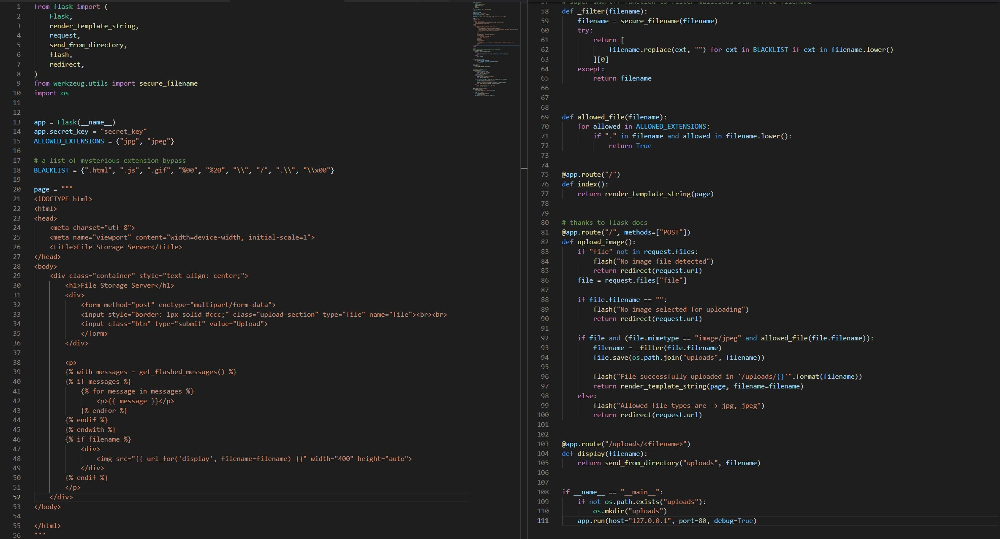

### SecurityExplained S-62: Vulnerable Code Snippet - 46

#### Vulnerable Code: 

#### Solution: 

The code is vulnerable to File Upload Bypass attacks. Due to a lack of whitelist utilization, it is possible to bypass the extension check and upload a malicious files.

Twitter Thread: https://twitter.com/harshbothra_/status/1499322445265661956

##### Code Credits: @0xRyuk
 