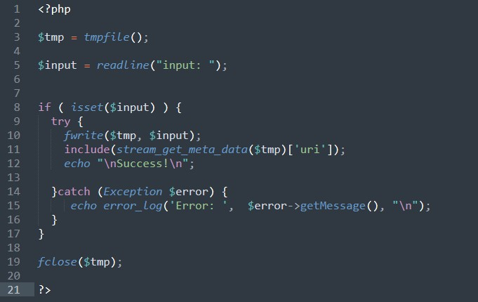

### SecurityExplained S-68: Vulnerable Code Snippet - 47

#### Vulnerable Code: 

#### Solution: 

The code takes input into a fwrite() and gives it the function include() which use "stream_get_meta_data" to read headers and metadata for later use. The '$input' is inserted into fwrite() without any filter. 
This makes it possible to infect a new "<?php ... ?>" tag and execute php code.

Exploit Payload: <?php echo shell_exec('whoami')?>

Twitter Thread: https://twitter.com/harshbothra_/status/1501384795623882758

##### Code Credits: @Brumens2
 