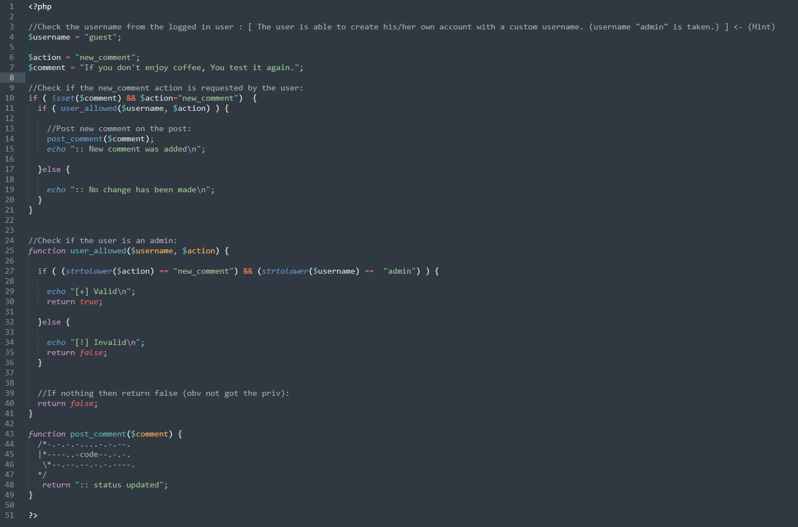

### SecurityExplained S-69: Vulnerable Code Snippet - 48

#### Vulnerable Code: 

#### Solution: 

The code checks if the username is "admin" should be the only user that is allowed to add new comments. The code does use the function "strtolower()".

This means if a user registers a new account with the username as "ADMIN" that do not have the privileges. The user is still able to add a new comment
and the filter is bypassed.

Twitter Thread: https://twitter.com/harshbothra_/status/1501738369990070275

##### Code Credits: @Brumens2
 