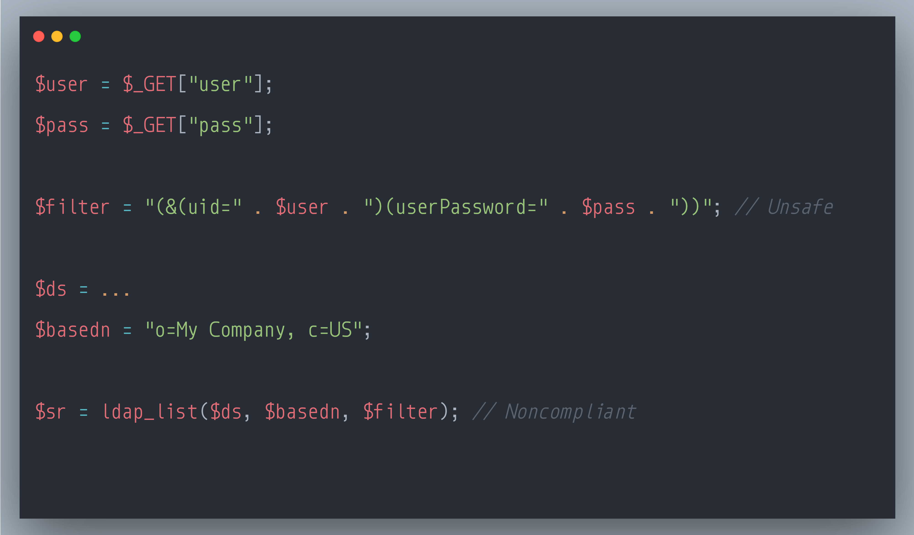

### SecurityExplained S-70: Vulnerable Code Snippet - 49

#### Vulnerable Code: 

#### Solution: 

This code is vulnerable to LDAP Injection. User-provided data such as URL parameters should always be considered as untrusted and tainted. Constructing LDAP names or search filters directly from tainted data enables attackers to inject specially crafted values that changes the initial meaning of the name or filter itself. Successful LDAP injections attacks can read, modify or delete sensitive information from the directory service.

Within LDAP names, the special characters ' ', '#', '"', '+', ',', ';', '<', '>', '\' and null must be escaped according to RFC 4514, for example by replacing them with the backslash character '\' followed by the two hex digits corresponding to the ASCII code of the character to be escaped. Similarly, LDAP search filters must escape a different set of special characters (including but not limited to '*', '(', ')', '\' and null) according to RFC 4515.

Reference: https://rules.sonarsource.com/php/type/Vulnerability/RSPEC-2078

Twitter Thread: https://twitter.com/harshbothra_/status/1502115860084785152

##### Code Credits: @SonarSource
 