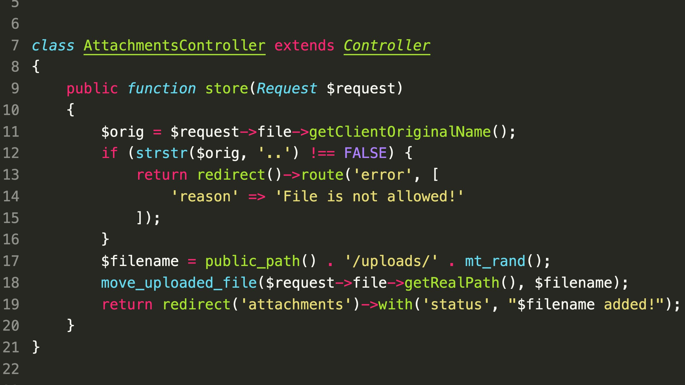

### SecurityExplained S-17: Vulnerable Code Snippet - 5

#### Vulnerable Code: 

#### Solution: 

The issue in this code snippet is that the files are stored without any extension. The Apache does not attach a Content-Type header in the response. Modern browsers will interpret these files as HTML which may lead to an attack such as Stored Cross-Site Scripting.

##### Code Credits: SonarSource