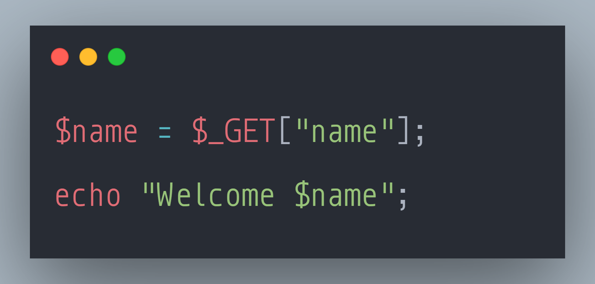

### SecurityExplained S-71: Vulnerable Code Snippet - 50

#### Vulnerable Code: 

#### Solution: 

This is vulnerable to Cross-Site Scripting as there is no input sanitization on the $name. 

Reference: https://rules.sonarsource.com/php/type/Vulnerability/RSPEC-5131

Twitter Thread: https://twitter.com/harshbothra_/status/1502463146203631616

##### Code Credits: @SonarSource
 