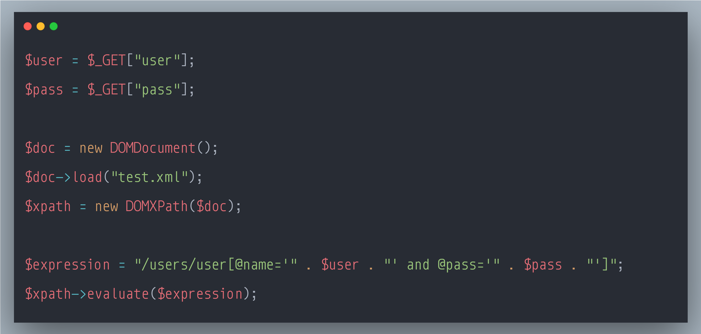

### SecurityExplained S-73: Vulnerable Code Snippet - 52

#### Vulnerable Code: 

#### Solution: 

This code is vulnerable to XPATH Injection. User-provided data, such as URL parameters, should always be considered untrusted and tainted. Constructing XPath expressions directly from tainted data enables attackers to inject specially crafted values that changes the initial meaning of the expression itself. Successful XPath injection attacks can read sensitive information from XML documents.

Reference: https://rules.sonarsource.com/php/type/Vulnerability/RSPEC-2091

Twitter Thread: https://twitter.com/harshbothra_/status/1503112764985815043

##### Code Credits: @SonarSource
 