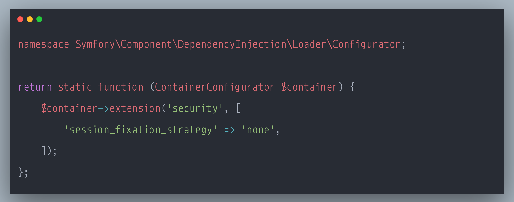

### SecurityExplained S-74: Vulnerable Code Snippet - 53

#### Vulnerable Code: 

#### Solution: 

This code is vulnerable to Session Fixation Attacks. Session fixation attacks occur when an attacker can force a legitimate user to use a session ID that he knows.

To avoid fixation attacks, it’s a good practice to generate a new session each time a user authenticates and delete/invalidate the existing session (the one possibly known by the attacker).

Reference: https://t.co/gdwErw0aml

Twitter Thread: https://twitter.com/harshbothra_/status/1503559120841949186

##### Code Credits: @SonarSource
 