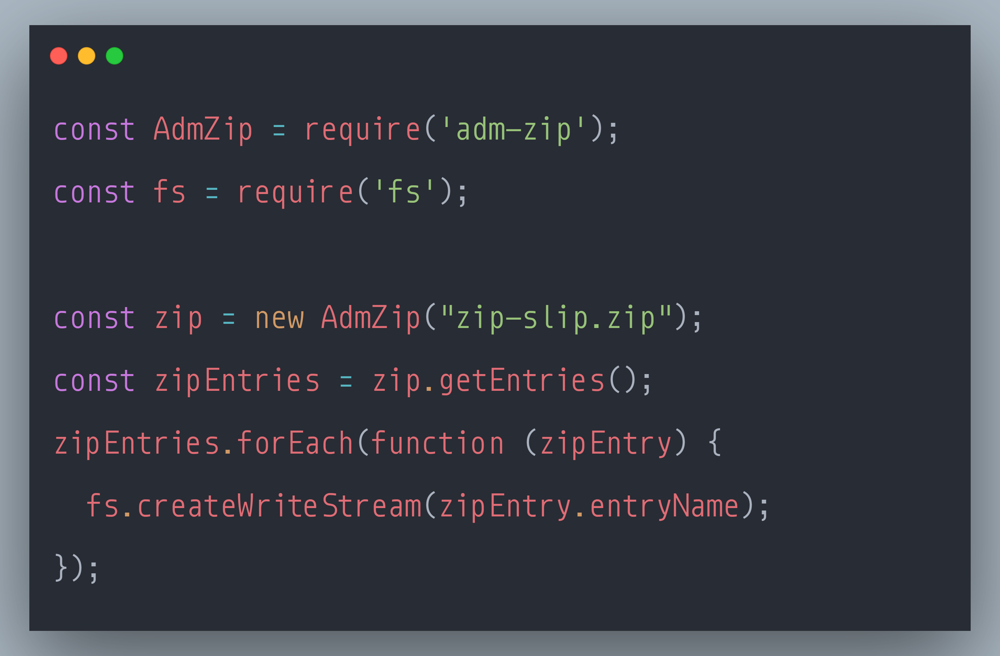

### SecurityExplained S-75: Vulnerable Code Snippet - 54

#### Vulnerable Code: 

#### Solution: 

This code is vulnerable to ZipSlip Attack. 

File names of the entries in a zip archive should be considered untrusted, tainted and should be validated before being used for file system operations. Indeed, file names can contain specially crafted values, such as '../', that change the initial path and, when accessed, resolve to a path on the filesystem where the user should normally not have access.

A successful attack might give an attacker the ability to read, modify, or delete sensitive information from the file system and sometimes even execute arbitrary operating system commands. This special case of path injection vulnerabilities is called "zip slip".

The mitigation strategy should be based on the whitelisting of allowed paths or characters.

Reference: https://rules.sonarsource.com/javascript/type/Vulnerability/RSPEC-6096

Twitter Thread: https://twitter.com/harshbothra_/status/1503912699104702464

##### Code Credits: @SonarSource
 