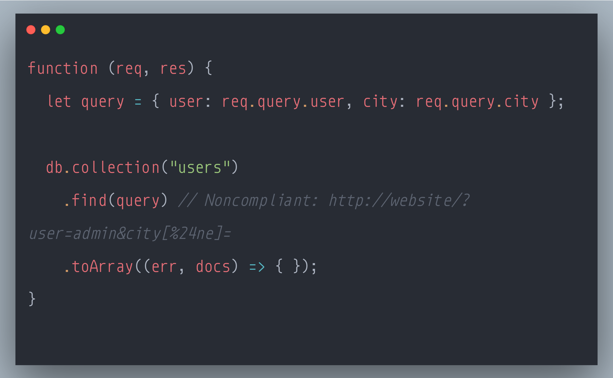

### SecurityExplained S-76: Vulnerable Code Snippet - 55

#### Vulnerable Code: 

#### Solution: 

This code is vulnerable to NoSQL Injection Attack.

User-provided data such as URL parameters and POST body-content should always be considered untrusted and tainted.

Applications that perform NoSQL operations based on tainted data can be exploited similarly to regular SQL injection bugs. Depending on the code, the same risks exist as with SQL injections: The attacker aims to access sensitive information or compromise data integrity. Attacks may involve the injection of query operators, JavaScript code, or string operations.

This problem can be mitigated by using an Object Document Mapper (ODM) library or by validating user-supplied data based on its size or allowed characters.

Since Javascript allows different types of HTTP parameters, the problem could be mitigated by ensuring that the type of the input is a String or by sanitizing the user-provided data.

Reference: https://rules.sonarsource.com/javascript/type/Vulnerability/RSPEC-5147

Twitter Thread: https://twitter.com/harshbothra_/status/1504305286869241857

##### Code Credits: @SonarSource
 