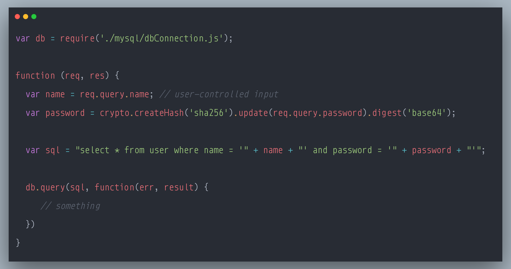

### SecurityExplained S-77: Vulnerable Code Snippet - 56

#### Vulnerable Code: 

#### Solution: 

This code is vulnerable to SQL Injection Attack.

User-provided data, such as URL parameters, should always be considered untrusted and tainted. Constructing SQL queries directly from tainted data enables attackers to inject specially crafted values that change the initial meaning of the query itself. Successful database query injection attacks can read, modify, or delete sensitive information from the database and sometimes even shut it down or execute arbitrary operating system commands.

Typically, the solution is to use prepared statements and to bind variables to SQL query parameters with dedicated methods like setParameter, which ensures that user-provided data will be properly escaped. Another solution is to validate every parameter used to build the query. This can be achieved by transforming string values to primitive types or by validating them against a white list of accepted values.

Reference: https://rules.sonarsource.com/javascript/type/Vulnerability/RSPEC-3649

Twitter Thread: https://twitter.com/harshbothra_/status/1504637477297934337

##### Code Credits: @SonarSource
 