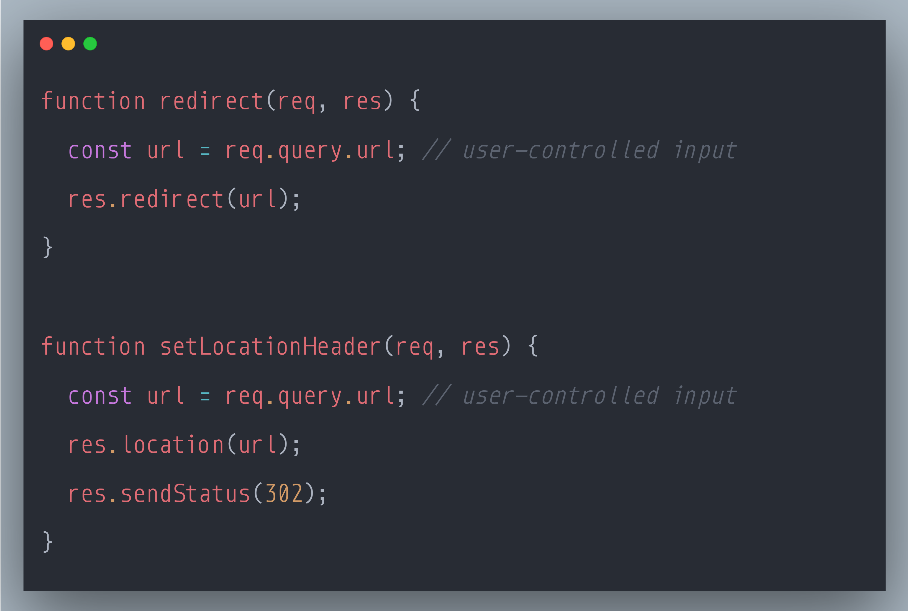

### SecurityExplained S-79: Vulnerable Code Snippet - 58

#### Vulnerable Code: 

#### Solution: 

This code is vulnerable to Open Redirection Attack. 

These minimum restrictions should be applied when handling file uploads:

the file upload folder to restrict untrusted files to a specific folder.
the file extension of the uploaded file to prevent remote code execution.
Also the size of the uploaded file should be limited to prevent denial of service attacks. 

Reference: https://rules.sonarsource.com/javascript/type/Vulnerability/RSPEC-5146

Twitter Thread: https://twitter.com/harshbothra_/status/1505392450499584003

##### Code Credits: @SonarSource
 