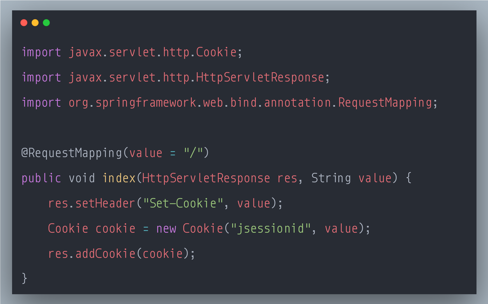

### SecurityExplained S-80: Vulnerable Code Snippet - 59

#### Vulnerable Code: 

#### Solution: 

This code is vulnerable to Session Fixation Attack.

User-provided data, such as URL parameters, should always be considered untrusted and tainted. Constructing cookies directly from tainted data enables attackers to set the session identifier to a known value, allowing the attacker to share the session with the victim. Successful attacks might result in unauthorized access to sensitive information, for example if the session identifier is not regenerated when the victim authenticates.

Typically, the solution to prevent this type of attack is to restrict the cookies that can be influenced with an allow-list.

Reference: https://rules.sonarsource.com/java/type/Vulnerability/RSPEC-6287

Twitter Thread: https://twitter.com/harshbothra_/status/1505733449285468165

##### Code Credits: @SonarSource
 