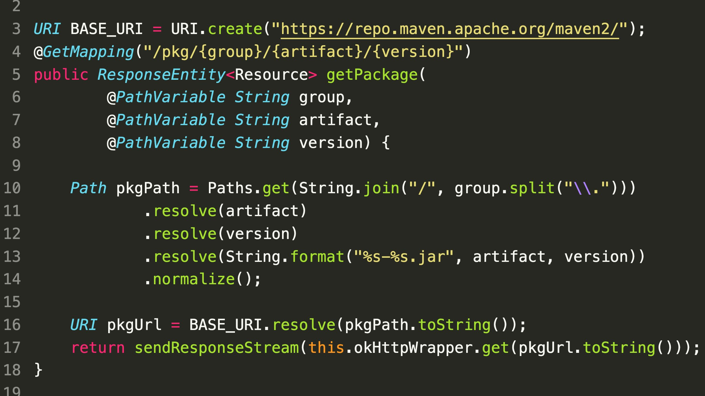

### SecurityExplained S-18: Vulnerable Code Snippet - 6

#### Vulnerable Code:

#### Solution:

The code is vulnerable to SSRF attack. The issue in this code snippet is that the Java's URI.resolve() will return its parameter if it is an absolute URL, which can be abused to perform SSRF. By using http:/example.com# as artifact the final URL will start with http:/example.com#, which the OkHttp library will accept when making the request.

##### Code Credits: SonarSource

[Follow Twitter Thread](https://twitter.com/harshbothra_/status/1483501885235417090?s=20&t=DGEwqEwXwFbWH0VXkOKVsQ)
