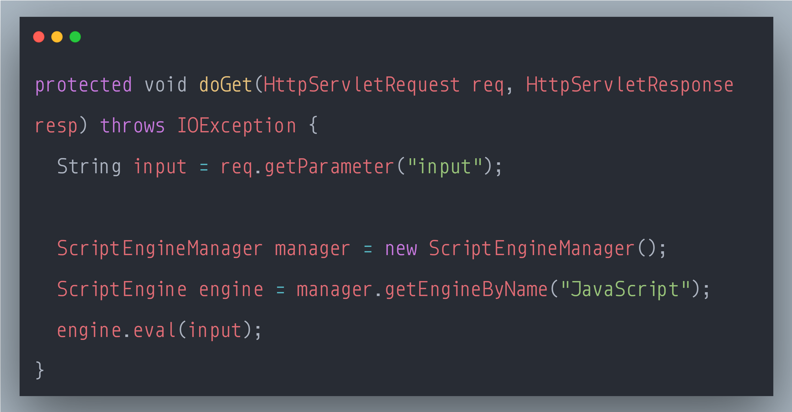

### SecurityExplained S-81: Vulnerable Code Snippet - 60

#### Vulnerable Code: 

#### Solution: 

This code is vulnerable to Remote Code Execution. 

Applications that execute code dynamically should neutralize any externally-provided values used to construct the code. Failure to do so could allow an attacker to execute arbitrary code. This could enable a wide range of serious attacks like accessing/modifying sensitive information or gain full system access.

The mitigation strategy should be based on whitelisting of allowed values or casting to safe types.

Reference: https://rules.sonarsource.com/java/type/Vulnerability/RSPEC-5334

Twitter Thread: https://mobile.twitter.com/harshbothra_/status/1506095330395258885

##### Code Credits: @SonarSource
 