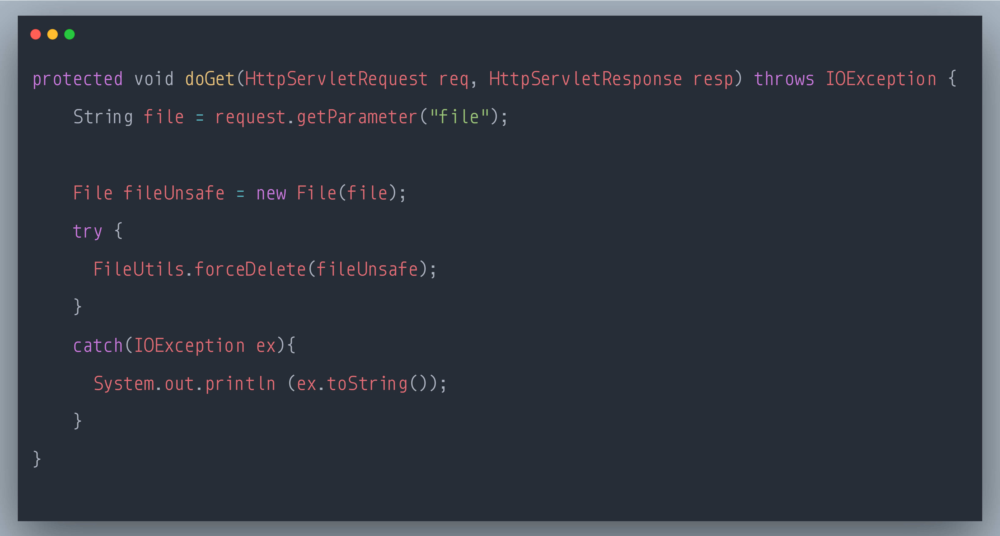

### SecurityExplained S-84: Vulnerable Code Snippet - 63

#### Vulnerable Code: 

#### Solution: 

This code is vulnerable to Path Injection Attack. 

User-provided data, such as URL parameters, POST data payloads, or cookies, should always be considered untrusted and tainted. Constructing file system paths directly from tainted data could enable an attacker to inject specially crafted values, such as '../', that change the initial path and, when accessed, resolve to a path on the filesystem where the user should normally not have access.

A successful attack might give an attacker the ability to read, modify, or delete sensitive information from the file system and sometimes even execute arbitrary operating system commands. This is often referred to as a "path traversal" or "directory traversal" attack.

The mitigation strategy should be based on the whitelisting of allowed paths or characters.

Reference: https://rules.sonarsource.com/java/type/Vulnerability/RSPEC-2078

Twitter Thread: https://twitter.com/harshbothra_/status/1507167395315548171

##### Code Credits: @SonarSource
 