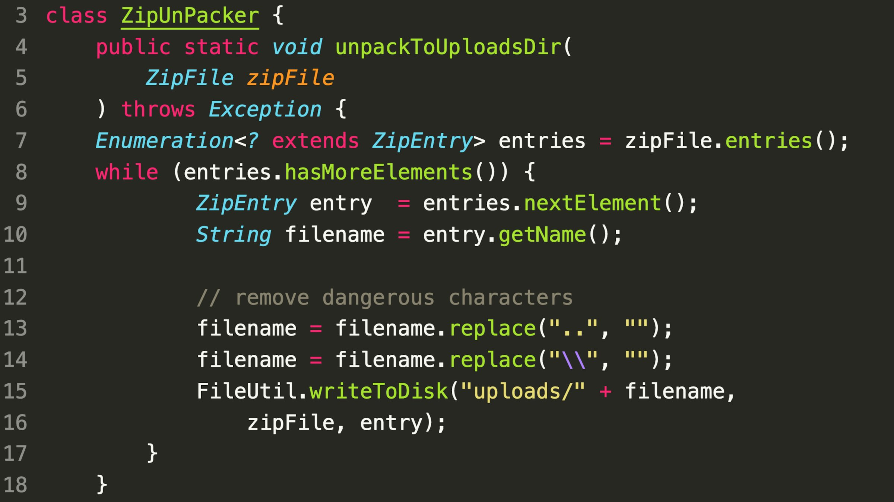

### SecurityExplained S-20: Vulnerable Code Snippet - 8

#### Vulnerable Code: 

#### Solution: 

The code is vulnerable to path traversal attack. There is a sanitization against this attack but the protection is not sufficient and can be bypassed with the payloads such as ".\./.\.shell.jsp". 

##### Code Credits: SonarSource