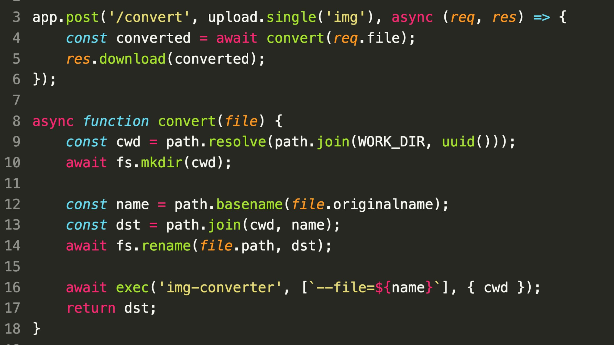

### SecurityExplained S-21: Vulnerable Code Snippet - 9

#### Vulnerable Code:

#### Solution:

The code is vulnerable to Remote Code Execution by uploading a malicious file named as `img-converter.exe` that will then be executed instead of the one installed on the system.

As per Sonar Source, When executing commands by name (e.g. `img-converter`) on Windows, the OS looks for the executable in the current directory first and only after that in the PATH. This applies here because the command is executed in the directory where the file is copied to.

##### Code Credits: SonarSource

[Follow Twitter Thread](https://twitter.com/harshbothra_/status/1484590293483945984?s=20&t=DGEwqEwXwFbWH0VXkOKVsQ)
